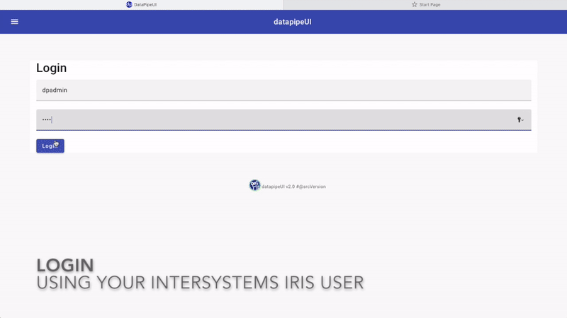
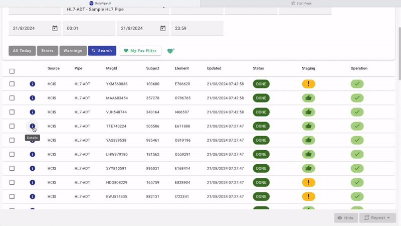

DataPipe an interoperability framework to ingest data in InterSystems IRIS in a flexible way.


# QuickStart
You can try out the included quickstart container to have a look at DataPipe. 

## Run container
```bash
docker compose up -d
```

## Interoperability production
DataPipe uses interoperability framework.

Check [DataPipe.Test.Production](http://localhost:52773/csp/dpipe/EnsPortal.ProductionConfig.zen?PRODUCTION=DataPipe.Test.Production) interoperability production loggin-in as `superuser` / `SYS`.

Now, you only need to generate some data.

## Generate sample data
Now you can generate some sample data that will be processed in your pipes:

* Open an [WebTerminal](http://localhost:52773/terminal/) interactive session (terminal)

* Generate data
```objectscript
do ##class(DataPipe.Test.Helper).QuickStart()
```

* You can have a look at the [DataPipe.Test.Production](http://localhost:52773/csp/dpipe/EnsPortal.ProductionConfig.zen?PRODUCTION=DataPipe.Test.Production) and see how messages has been processed.

## DataPipeUI
DataPipe includes an UI that allows you to manage the data that has been processed.

Follow these steps to run [datapipeUI](https://github.com/intersystems-ib/iris-datapipeUI).

1. In other directory, clone [datapipeUI](https://github.com/intersystems-ib/iris-datapipeUI) repository

```bash
git clone https://github.com/intersystems-ib/iris-datapipeUI
```

2. Run UI container:

```bash
cd iris-datapipeUI
docker compose up -d
```

3. Log-in the UI at http://localhost:8080 using `dpadmin` / `demo`

* Have a look at the defined **Pipes**
* Check the Activity **Dashboard** 
* Try out **filtering** the records that have been processed: 


* Click on some record details and inspect **Ingestion**, **Staging** and **Operation**
* View the record history and even try to repeat some of the stages and see what happens.


# Features

## Defining Pipes
* You need to define your Pipes: set a code and some description.
* Optionally you can specify an InterSystems IRIS security resource that will be required to view that pipe.

## Processing data
When processing data you need to follow these steps:

### 1) Define a DataPipe Model
You need to define a model for the data you want to ingest. 
A model is a class that extends from [DataPipe.Model.cls](src/DataPipe/Model.cls) where you must implement some methods.


In your model you will implement:
* How to serialize / deserialize your data (e.g. using JSON or XML).
* How to Normalize and Validate your data.
* And finally, what operation you want to run with your data after it is normalized and validated.

Have a look at these examples:
* [DataPipe.Test.HL7.Models.A08.cls](src/DataPipe/Test/HL7/Models/A08.cls) - a model for processing information of incoming HL7 messages
* [DataPipe.Test.REST.Models.Person.cls](src/DataPipe/Test/REST/Models/Person.cls) - a model for processing information of incoming REST requests with some person data

### 2) Add Interoperability components
* After defining your model, you need to setup an interoperability production using DataPipe components
* DataPipe provides Business Processes and Operations that can work with a DataPipe model.
* The only Business Process you must define is your Ingestion Process.


#### 2.1) Create an Ingestion Process
You need to implement an **Ingestion process** using [DataPipe.Ingestion.BP.IngestionManagerContext](src/DataPipe/Ingestion/BP/IngestionManagerContext.cls) as context.

This process will receive an input and will implement:
* `Input > InboxAttributes`: 
    * Extract some input information and define the attributes of your data.
    * The **Pipe** the data belongs to is an attribute you must specify.
    * These attributes will describe your data and will be used afterwards for searching.
* `Input > Model`: 
    * Decide how your incoming data will be transformed into the DataPipe model you have previously defined.

You can find examples here:
* [DataPipe.Test.HL7.BP.HL7Ingestion.cls](src/DataPipe/Test/HL7/BP/HL7Ingestion.cls) - ingestion process for incoming HL7 messages
* [DataPipe.Test.REST.BP.RESTIngestion.cls](src/DataPipe/Test/REST/BP/RESTIngestion.cls) - ingestion process for incoming REST messages

#### 2.1) Add the rest of components
Rest of the components are provided by DataPipe you need to add are provided by DataPipe.
These components will call the different methods you have in your model.

Usually you will add:
* The Ingestion process you have implemented before.
* A [DataPipe.Staging.BP.StagingManager](src/DataPipe/Staging/BP/StagingManager.cls) process.
* A [DataPipe.Oper.BP.OperManager](src/DataPipe/Oper/BP/OperManager.cls) process.
* And a [DataPipe.Oper.BO.OperationHandler](src/DataPipe/Oper/BO/OperationHandler.cls) operation.

Have a look at a full example in [DataPipe.Test.Production.cls](src/DataPipe/Test/Production.cls)

## Users and privileges
DataPipe uses different security resources you can assign to InterSystems IRIS user account.

Consider the following:

Resources:
* `DP_ADMIN` - DataPipe Administrator
* `DP_MENU_DASHBOARD` - Access to Dashboard menu option in UI
* `DP_MENU_SEARCH` - Access to Search menu option in UI

SQL Tables:
Give the user access to:
* `DataPipe_Data.Pipe`

SQL Views:
Also, make sure the user can SELECT in these views:
* `DataPipe_Data.VInbox`
* `DataPipe_Data.VIngestion`
* `DataPipe_Data.VOper`
* `DataPipe_Data.VStaging`

You can see a full example in the included container: check out the [DataPipe_Admin](http://localhost:52773/csp/sys/sec/%25CSP.UI.Portal.Role.zen?PID=DataPipe_Admin) role definition in InterSystems IRIS. 

# Installation
1) Install [IPM package manager](https://github.com/intersystems/ipm) if you don't have already done it.
2) Create a new namespace (e.g. `DPIPE`)
3) Switch to the namespace you want to install DataPipe.
4) Install DataPipe using ipm:

```
DPIPE> zpm "install iris-datapipe"
```
## DataPipeUI considerations

When enabling [datapipeUI](https://github.com/intersystems-ib/iris-datapipeUI), you must consider the following:

### CORS
You must consider CORS restrictions.
You can see a basic example [here](https://github.com/intersystems-ib/iris-datapipe/blob/master/src/Form/REST/Abstract.cls#L18) that allows any incoming connection (this is only recommended for testing).

### Database resource
Make sure that `CSPSystem` user in InterSystems IRIS have read permission on the resource of the database where you have installed DataPipe. 

Want to contribute to this project? See [CONTRIB.md](./CONTRIB.md)
