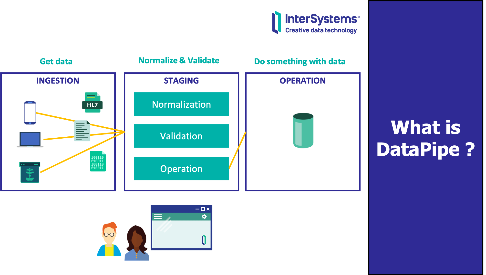

*DataPipe* is an **InterSystems IRIS** application which provides a set of re-usable components you can use to handle incoming data flow into ingestion, staging and operation phases in a homogeneus and flexible way.



Want to contribute to this project? See [CONTRIB.md](./CONTRIB.md)

# QuickStart
* Have a look at [CONTRIB.md](./CONTRIB.md) to build your local development environment (Docker).
* Also, check out the Angular UI project at [datapipeUI](https://github.com/intersystems-ib/iris-datapipeUI).


# Requirements
* InterSystems IRIS
* [RESTForms2](https://github.com/intersystems-community/RESTForms2)

# Installation
Download repository:
```
cd /tmp
git clone https://github.com/intersystems-ib/iris-datapipe
```

Install:
```objectscript
// load installer
do $SYSTEM.OBJ.Load("/tmp/iris-datapipe/src/DataPipe/Installer.cls", "ck")

// set installer options
// -- namespace to install
set vars("Namespace")="DPIPE"
// -- web application name (REST API)
set vars("WebApp")="/dpipe/api"
// -- path to source code
set vars("SourcePath")="/tmp/iris-datapipe/src/"

// run installer
do ##class(DataPipe.Installer).Run(.vars)
```
