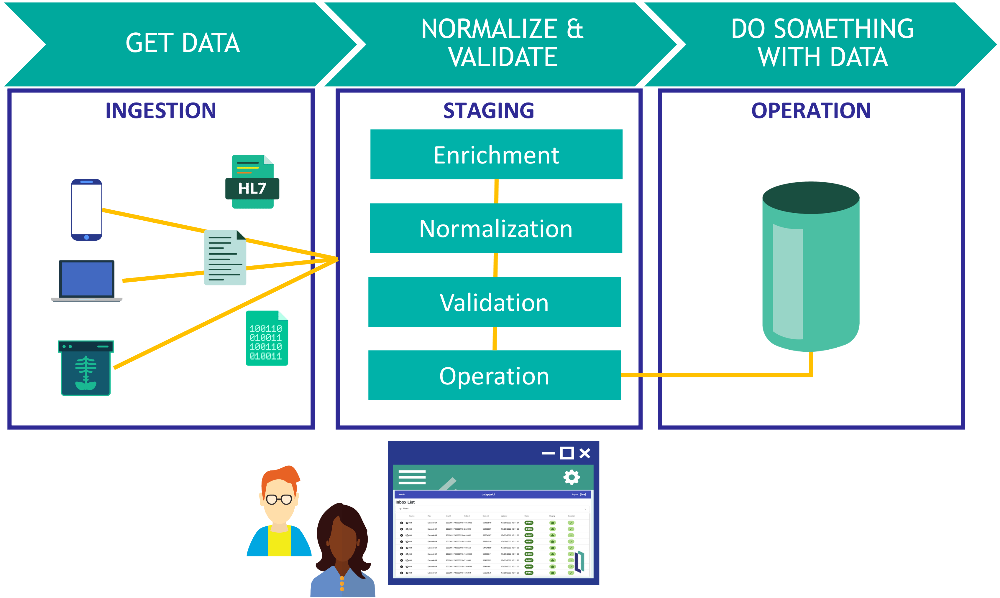
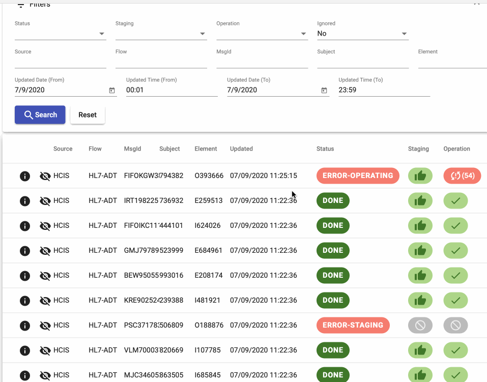
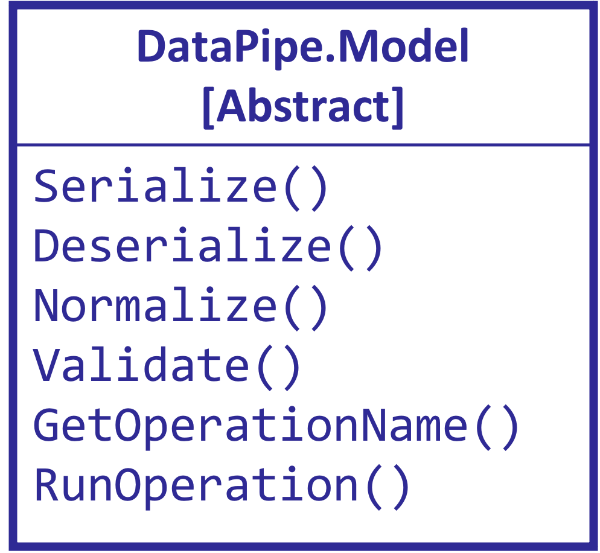
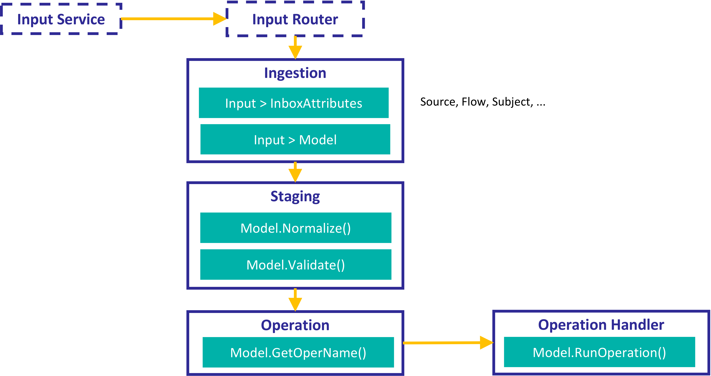

DataPipe an interoperability framework to ingest data in InterSystems IRIS in a flexible way.



# QuickStart

* Run development container
```
docker compose up -d
```

* Log-in to the system using `superuser` / `SYS`.

* Generate sample data using [WebTerminal](http://localhost:52773/terminal/)
```objectscript
do ##class(DataPipe.Test.HL7.Helper).GenerateFilesHL7ADT(100)
```

* Checkout interoperability production [DataPipe.Test.Production](http://localhost:52773/csp/dpipe/EnsPortal.ProductionConfig.zen?PRODUCTION=DataPipe.Test.Production).

## DataPipeUI
You can use [datapipeUI](https://github.com/intersystems-ib/iris-datapipeUI) as a user interface:

1. In other directory, clone [datapipeUI](https://github.com/intersystems-ib/iris-datapipeUI) repository

```
git clone https://github.com/intersystems-ib/iris-datapipeUI
```

2. Run UI container:

```
cd iris-datapipeUI
docker compose up -d
```

3. Check the generated sample data using the UI at http://localhost:8080




# Ingest data using DataPipe

## Model
You need to define a model for the data you want to ingest. 
A model a class that extends from [DataPipe.Model.cls](src/DataPipe/Model.cls) where you must implement some methods.



In your model you will implement:
* How to serialize / deserialize your data (e.g. using JSON or XML).
* How to Normalize and Validate your data.
* And finally, what operation you want to run with your data after it is normalized and validated.

You can find a full example in [DataPipe.Test.HL7.Models.A08.cls](src/DataPipe/Test/HL7/Models/A08.cls)

## Interoperability components
After defining your model, you can develop your interoperability production using DataPipe components.



You need to implement an **Ingestion process** which must provide:
* `Input > InboxAttributes` transformation: here you extract the attributes that describe your input data. You will be able to search data using these attributes.
* `Input > Model transformation` transformation: transform your incoming data into the DataPipe model you have previously defined.

Rest of the components are provided by DataPipe and they will call your model methods.

You can have a look at a full example in [DataPipe.Test.Production.cls](src/DataPipe/Test/Production.cls)

# Installation
1) Install [IPM package manager](https://github.com/intersystems/ipm) if you don't have already done it.
2) Create a new namespace (e.g. `DPIPE`)
3) Switch to the namespace you want to install DataPipe.
4) Install DataPipe using ipm:

```
DPIPE> zpm
zpm:DPIPE> install iris-datapipe
```

Want to contribute to this project? See [CONTRIB.md](./CONTRIB.md)
